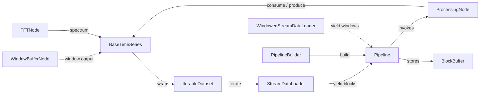
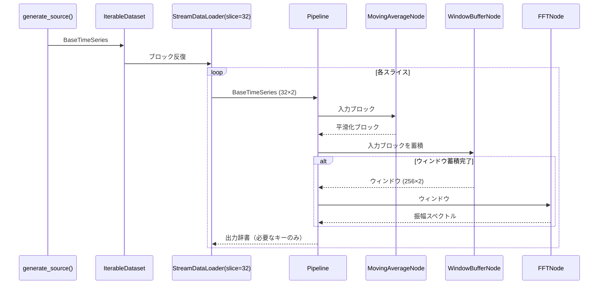

# simple モジュール構成概要

`simple/` ディレクトリは、時系列データを扱う軽量パイプラインの試作実装です。センサー由来の時系列ブロックを `BaseTimeSeries` で表現し、`Dataset`/`DataLoader`/`ProcessingNode` を通じて処理パイプラインへ供給します。

## クラスの役割

| モジュール | クラス | 役割 |
|------------|--------|------|
| `data.py` | `BaseTimeSeries` | サンプル数 × センサー数の 2D 配列とメタデータを保持する不変ブロック。スライスやコピーでメタ情報を維持しながら部分抽出が可能。 |
| `data.py` | `BlockBuffer` | パイプライン内でノード間の `BaseTimeSeries` をキー付きで共有する簡易ストア。|
| `dataset.py` | `Dataset` | `BaseTimeSeries` を反復可能に提供するインターフェース。長さ取得は必須でないため例外を投げるデフォルト実装を持つ。 |
| `dataset.py` | `IterableDataset` | 単一の `BaseTimeSeries` をラップし、インデックス/スライスによる取得や負インデックス正規化を提供。|
| `dataloader.py` | `StreamDataLoader` | `Dataset` から `BaseTimeSeries` を順次読み出し、必要に応じて固定長スライスへ分割。最大出力数や端数の扱いを制御。|
| `dataloader.py` | `WindowedStreamDataLoader` | ウィンドウサイズとホップ幅でオーバーラップを持つウィンドウ列を生成。端数破棄の制御や出力数制限を提供。|
| `node.py` | `ProcessingNode` | パイプライン内の処理ノード基底クラス。依存キー/出力キー/状態リセット/処理メソッドを定義。|
| `node.py` | `MovingAverageNode` | 入力ブロックに移動平均フィルタを適用して滑らかな出力を生成。不足サンプル時は入力をそのまま透過。|
| `node.py` | `WindowBufferNode` | 連続する入力ブロックを内部バッファに蓄積し、指定サイズ/ホップのウィンドウを組み立てる。タイムスタンプとメタデータをウィンドウに合わせて更新。|
| `node.py` | `FFTNode` | 入力ブロックに対してリアル FFT を計算し、振幅スペクトルと周波数配列をメタデータに付与した `BaseTimeSeries` を出力。|
| `pipeline.py` | `PipelineBuilder` | ノード追加と依存関係解決を行い、`Pipeline` を生成するビルダー。|
| `pipeline.py` | `Pipeline` | `StreamDataLoader` とノード群を用いてブロック処理を実行。`BlockBuffer` を介してノード入出力を管理し、必要なキーのみを最終出力として返す。|
| `pipeline.py` | `resolve_order` | ノードの依存キーを満たす順序へトポロジカルソート。未解決依存が残る場合は例外を送出。|
| `trial01.py` | `generate_source` | サイン波・コサイン波の合成で 2 チャネルの `BaseTimeSeries` を生成するユーティリティ。|
| `trial01.py` | `trial` | `IterableDataset` → `StreamDataLoader` → `Pipeline` の実行例。`MovingAverageNode`・`WindowBufferNode`・`FFTNode` を組み合わせた処理をログ出力。|

## クラス間の関係

## 処理フロー例 (`trial01.py`)

## 設計上のポイント

- `BaseTimeSeries` は 2D 配列を強制し、チャネル（センサー）軸を明示。
- `Dataset`/`DataLoader` はブロック分割・ウィンドウ化を担当し、パイプラインは変換処理に集中。
- ノードは依存キーを宣言し、`Pipeline` が `BlockBuffer` を介してデータを連結。
- `WindowBufferNode` と `WindowedStreamDataLoader` は役割が似ているが、前者はノードとしてパイプライン内でバッファリング、後者は前処理段階でウィンドウ化を担当。

## 将来的な拡張案

- `dataset.py` の `MultiSensorDataset` や `node.py` のコメントアウトされたノード群を再実装してセンサー分割・正規化を提供。
- `Pipeline` にモニタリングやエラーポリシーを追加し、本シンプル版から本体実装へ移行しやすくする。
- DataLoader レイヤーでバッチ化・センサー選択などのユーティリティを追加。
