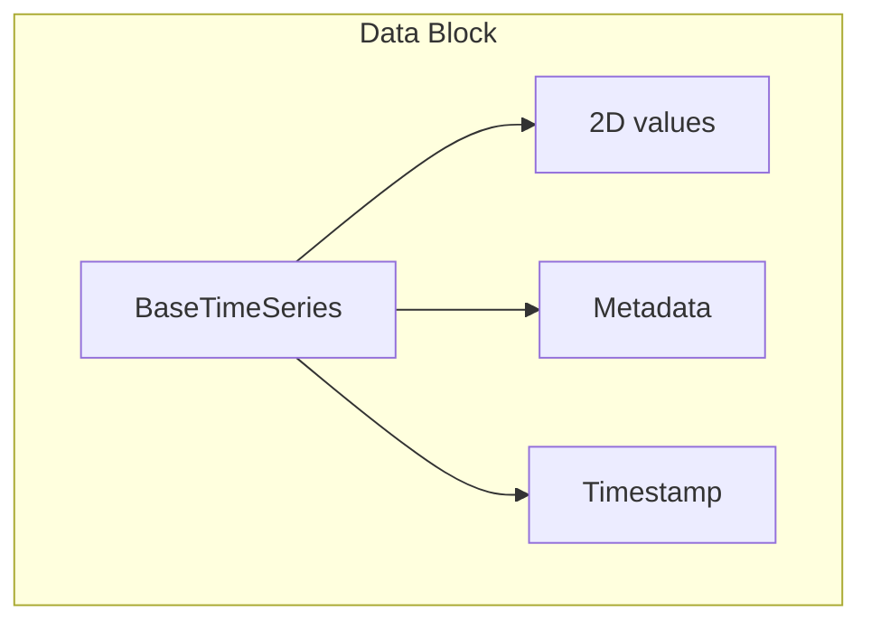
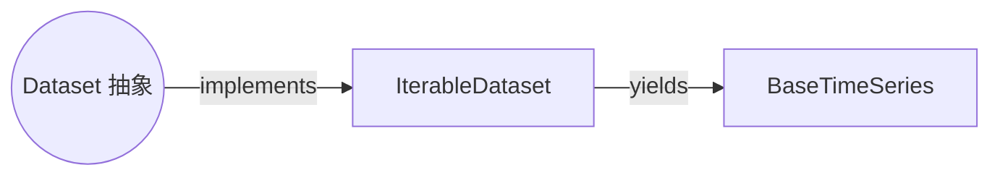
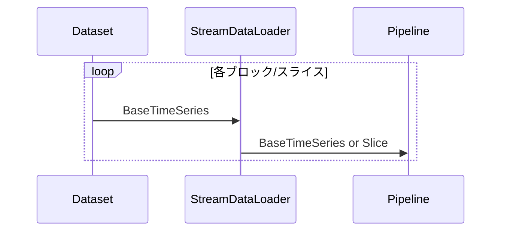
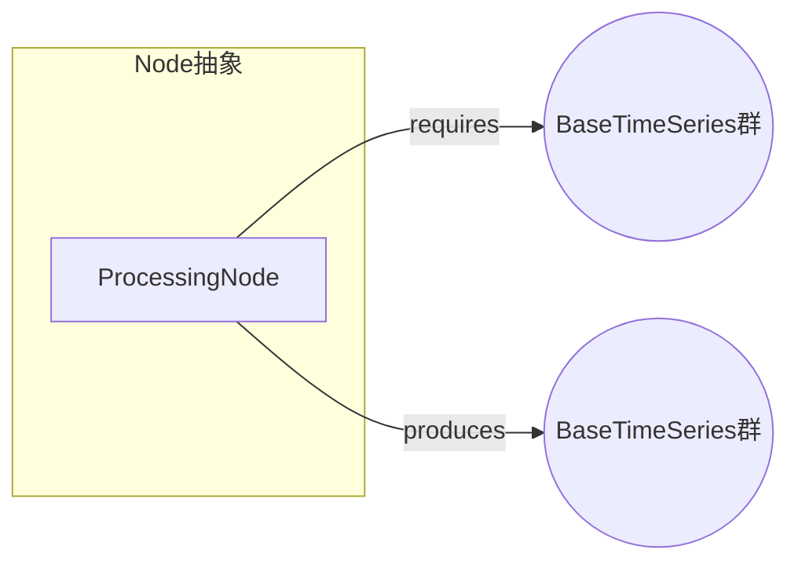
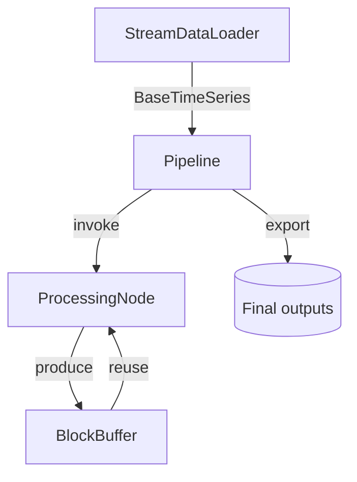
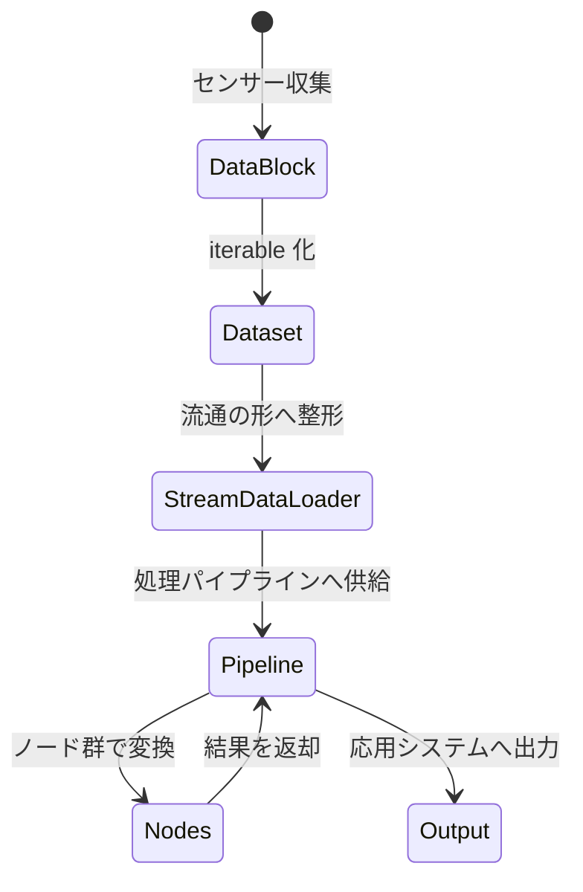

# 抽象レベルでみる simple モジュール

このドキュメントでは、`simple/` モジュールを構成する主要コンポーネントを「抽象クラス」の視点で整理します。具体的な実装詳細ではなく、各コンポーネントがどのような役割を担い、どのように連携するかを理解することを目的としています。

## Core Data: BaseTimeSeries

- **役割**: センサー由来の時系列ブロックを表す最小単位。
- **抽象化ポイント**:
  - データは必ず `samples × channels` の 2 次元配列として扱う。
  - メタデータとタイムスタンプを必須情報として添付し、処理チェーンを通じて引き継ぐ。
  - 不変（immutable）な値オブジェクト。加工は `copy_with` やスライスで新しいブロックを生成する。

## Dataset: データ提供インターフェース

- **抽象クラス `Dataset`**:
  - 役割: `BaseTimeSeries` を逐次提供するインターフェース。
  - 最低限必要な操作は `__iter__` のみ。長さやランダムアクセスは必須ではない。
  - 実装側は「どの粒度でブロックを返すか」「どのようにオンデマンドに生成するか」を自由に決められる。

- **`IterableDataset`（具体実装）**:
  - 単一の `BaseTimeSeries` をラップし、反復すると一度だけブロックを返す。
  - `__getitem__` を通じてサンプル単位・ウィンドウ単位のサブブロックを取得できるようにし、抽象クラスの概念を具体化している。

## StreamDataLoader: データ流通の調整役

- **役割**:
  - `Dataset` から受け取ったブロックを、処理しやすい「ストリーム」としてパイプラインへ渡す。
  - 抽象クラスではないが、DataLoader 系の振る舞いを代表する実装。

- **抽象的な使い方**:
  1. `Dataset` が提供するブロックを反復。
  2. `slice_size` が指定されていればブロックを固定長に分割（ミニバッチ化に近い動き）。
  3. `max_blocks` や `drop_last` によって出力制御。

## ProcessingNode: 抽象処理ユニット

- **抽象クラス `ProcessingNode`**:
  - 役割: 入力ブロックを加工し、新しいブロックを出力するユニット。
  - 宣言的に `requires()` / `produces()` を定義し、依存関係を外部へ明示する。

- **具体例**:
  - `MovingAverageNode`: 時系列を滑らかにするフィルタノード。
  - `WindowBufferNode`: 時間的文脈を持つウィンドウを組み立てる。
  - `FFTNode`: 周波数領域への変換。

## Pipeline: オーケストレーション層

- **役割**:
  - `StreamDataLoader` から入力ブロックを受け取り、ノード群にデータを渡して結果を集約。
  - 依存関係を解決するのは `PipelineBuilder` の責務。抽象的に見れば、ノード間の DAG（有向非巡回グラフ）を構築するプロセス。

## 全体像（抽象フロー）

## まとめ

- **BaseTimeSeries** は全処理の最小単位で、値・メタデータ・時間情報を不変のまま保持する抽象オブジェクト。
- **Dataset** は「どの順番・どの単位で BaseTimeSeries を供給するか」を定義する抽象インターフェース。`IterableDataset` はその最小具体例。
- **StreamDataLoader** は抽象 DataLoader の代表例として、供給されたブロックをパイプラインに渡す際の調整役を担う。
- **ProcessingNode** は抽象処理単位であり、入力・出力キーで依存関係を明示しつつ変換を実施する。
- **Pipeline / PipelineBuilder** がこれらの抽象を連結し、ストリーム状に処理を実行する。

抽象クラス単位で理解すると、`simple/` パッケージは「`BaseTimeSeries` を中心に、抽象 `Dataset` がデータ供給を、`StreamDataLoader` が流通調整を、抽象 `ProcessingNode` 群が変換を担い、それらを `Pipeline` が束ねる」という構造で捉えられます。
