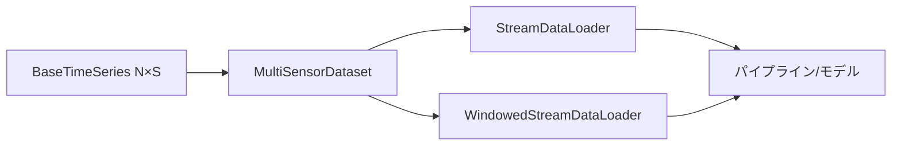
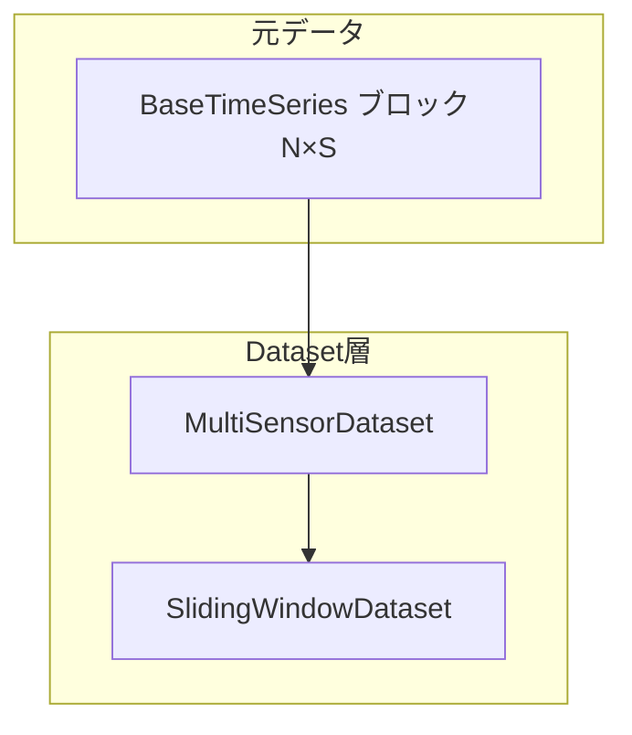
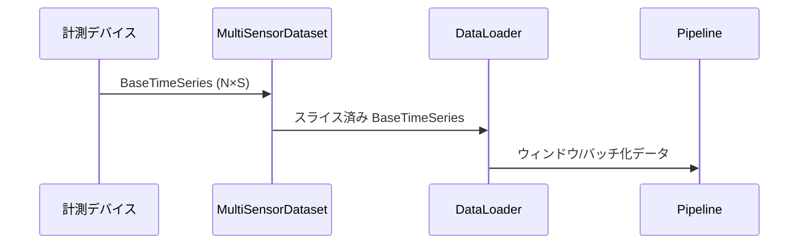

# マルチセンサー対応 Dataset / DataLoader 設計（現在の実装版）

## 現在の実装状況

- `BaseTimeSeries.values` は形状 `[N, S]`（N: サンプル数, S: センサー数）で実装済み
- `IterableDataset` が `__getitem__` でサンプル・ウィンドウ取得をサポート
- `StreamDataLoader` と `WindowedStreamDataLoader` が実装済み
- `BaseTimeSeries` のスライス機能とメタデータ継承が動作中



## `BaseTimeSeries` の実装済み機能

- `values` は 2 次元配列 `[N, S]` を保持（`_ensure_array` で自動変換）
- `__getitem__` でスライス取得が可能（タイムスタンプも自動調整）
- `copy_with` メソッドで値・メタデータの部分更新をサポート
- `block_size`, `sensor_count`, `duration_seconds` プロパティを提供
- メタデータにスライス情報を自動記録

## Dataset の現在の実装

### `IterableDataset`（実装済み）

- 単一の `BaseTimeSeries` を受け取り、`__getitem__` で：
  - 単一サンプル: `[idx:idx+1]`
  - ウィンドウ: `[start:stop]`
  を返す
- `__len__` で全サンプル数を提供
- インデックス正規化（負のインデックス対応）を実装

### `MultiSensorDataset`（コメントアウト済み）

- 複数センサーの同期化機能は現在未実装
- 必要に応じて将来実装予定



## DataLoader の実装済み機能

### `StreamDataLoader`

- `Dataset` からの `BaseTimeSeries` を順次取得
- `slice_size` でブロック内分割をサポート
- `max_blocks` で出力数制限
- `drop_last` で不完全ブロックの処理制御

### `WindowedStreamDataLoader`

- 固定サイズウィンドウの生成
- `hop_size` でオーバーラップ制御
- `max_windows` で出力数制限
- ブロック境界での適切な処理

### `BatchCollatingDataLoader`（未実装）

- バッチ化機能は今後の実装予定



## パイプライン統合

1. **データ取得**: デバイスやファイルから `[N, S]` 形状の `BaseTimeSeries` ブロックを生成。
2. **Dataset**: `MultiSensorDataset` がサンプルまたはウィンドウ単位にスライスし、センサー名付きの `BaseTimeSeries` を返す。
3. **DataLoader**: 必要に応じてウィンドウ化やバッチ化を行い、パイプラインへ供給。
4. **パイプライン処理**: ノードは `values` の列を参照して特徴量抽出や融合を実行（列名→インデックスの対応はメタデータで解決）。
5. **出力**: 必要に応じて `BaseTimeSeries.copy_with` などを使い、新たなチャネル構成で結果を生成。

## 実装上の特徴

- `_ensure_array` で1次元データを自動的に2次元に変換
- スライス時にメタデータが自動継承（`metadata['slice']` に情報記録）
- タイムスタンプがスライス開始位置に応じて自動調整
- `frozen=True` でイミュータブル設計
- エラーハンドリングが充実（空配列、負のサンプルレートなど）

## 現在の利用例

```python
# BaseTimeSeriesの作成（多チャネル対応）
values = np.random.randn(1000, 6)  # 1000サンプル、6センサー
series = BaseTimeSeries(
    values=values,
    sample_rate=100.0,
    timestamp=datetime.now(),
    metadata={'sensors': ['accel_x', 'accel_y', 'accel_z', 'gyro_x', 'gyro_y', 'gyro_z']}
)

# IterableDatasetでラップ
dataset = IterableDataset(series)

# 単一サンプル取得
sample = dataset[0]  # shape: (1, 6)

# ウィンドウ取得
window = dataset[0:128]  # shape: (128, 6)

# StreamDataLoaderでスライス処理
loader = StreamDataLoader(dataset, slice_size=64)
for chunk in loader:
    # chunk.values shape == (64, 6)
    process_chunk(chunk)

# WindowedStreamDataLoaderでウィンドウ処理
window_loader = WindowedStreamDataLoader(dataset, window_size=128, hop_size=64)
for window in window_loader:
    # window.values shape == (128, 6)
    features = extract_features(window.values)
```

## 今後の拡張予定

- `MultiSensorDataset` の実装（複数センサー同期）
- `BatchCollatingDataLoader` の実装
- センサー選択・フィルタリング機能
